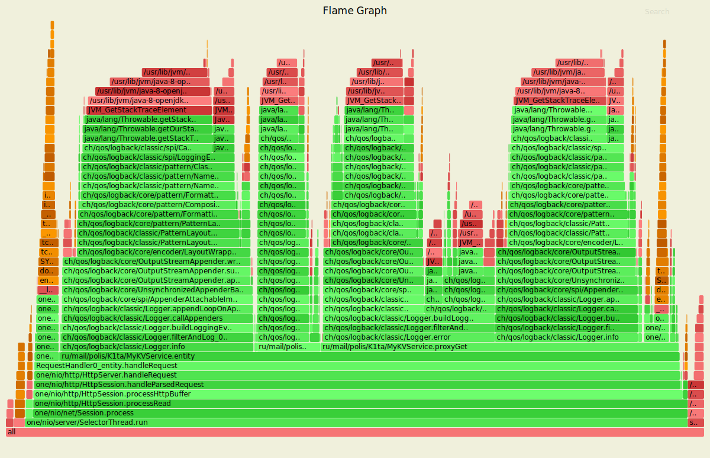
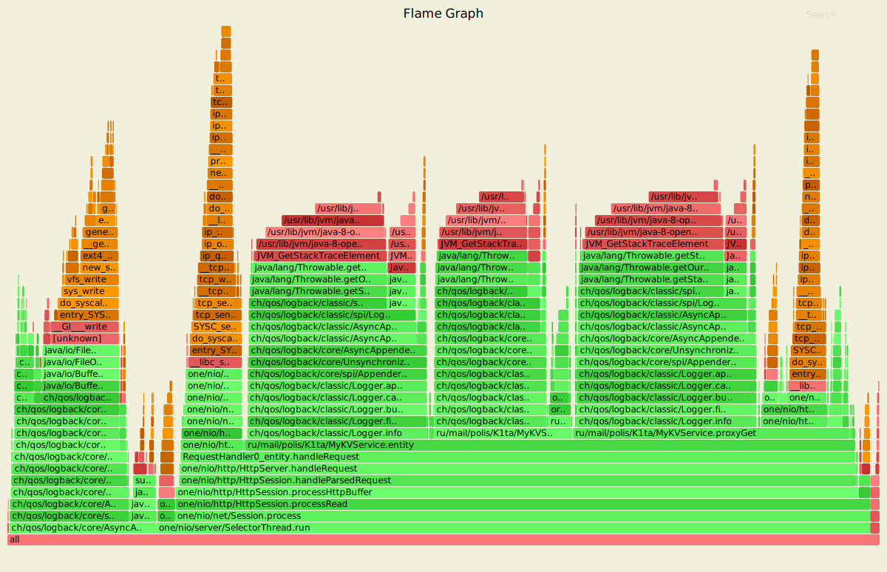

##До оптимизаций
###Flame graph


###PUT

```
$ wrk --latency -c4 -d10m -s scripts/put.lua http://localhost:8080
Running 10m test @ http://localhost:8080
  2 threads and 4 connections
  Thread Stats   Avg      Stdev     Max   +/- Stdev
    Latency     3.99ms    5.30ms 259.76ms   94.68%
    Req/Sec   565.97     69.29   777.00     76.45%
  Latency Distribution
     50%    3.02ms
     75%    4.53ms
     90%    7.01ms
     99%   16.29ms
  675616 requests in 10.00m, 43.17MB read
Requests/sec:   1125.86
Transfer/sec:     73.66KB
```

###GET
```
$ wrk --latency -c4 -d10m -s scripts/get.lua http://localhost:8080
Running 10m test @ http://localhost:8080
  2 threads and 4 connections
  Thread Stats   Avg      Stdev     Max   +/- Stdev
    Latency     6.24ms   10.62ms 419.58ms   97.17%
    Req/Sec   373.52    123.78   710.00     60.58%
  Latency Distribution
     50%    4.62ms
     75%    7.48ms
     90%   11.25ms
     99%   22.66ms
  445548 requests in 10.00m, 41.39MB read
  Non-2xx or 3xx responses: 312296
Requests/sec:    742.48
Transfer/sec:     70.63KB
```

###GET-PUT
```
$ wrk --latency -c4 -d10m -s scripts/get-put.lua http://localhost:8080
Running 10m test @ http://localhost:8080
  2 threads and 4 connections
  Thread Stats   Avg      Stdev     Max   +/- Stdev
    Latency     5.23ms   12.48ms 473.58ms   98.79%
    Req/Sec   463.67     50.57   680.00     73.20%
  Latency Distribution
     50%    3.71ms
     75%    5.93ms
     90%    9.02ms
     99%   18.73ms
  552780 requests in 10.00m, 44.24MB read
  Non-2xx or 3xx responses: 183823
Requests/sec:    921.20
Transfer/sec:     75.49KB
```
##После оптимизаций

Основное время занимала запись в лог. Настроил асинхронный вывод
логов в файл, логи с разных кластеров пишутся в разные файлы.
Также если файл достигает размера 500МБ, создается новый файл.

Пробовал различные схемы логирования, async -> rolling, 
async -> sift, но связка async -> sift -> rolling показала себя лучше всего.

В кластере убрал ненужные логи, часть вынес на уровень debug, 
часть логов объединил в один.
###Flame graph

###PUT
```
$ wrk --latency -c4 -d10m -s scripts/put.lua http://localhost:8080
Running 10m test @ http://localhost:8080
  2 threads and 4 connections
  Thread Stats   Avg      Stdev     Max   +/- Stdev
    Latency     0.98ms    7.21ms 290.26ms   99.68%
    Req/Sec     3.10k   420.74     4.30k    76.17%
  Latency Distribution
     50%  504.00us
     75%  657.00us
     90%    1.03ms
     99%    4.29ms
  3695350 requests in 10.00m, 236.12MB read
Requests/sec:   6158.23
Transfer/sec:    402.93KB
```
###GET
```
$ wrk --latency -c4 -d10m -s scripts/get.lua http://localhost:8080
Running 10m test @ http://localhost:8080
  2 threads and 4 connections
  Thread Stats   Avg      Stdev     Max   +/- Stdev
    Latency     1.42ms   11.22ms 436.61ms   99.53%
    Req/Sec     2.68k   225.57     4.40k    95.89%
  Latency Distribution
     50%  607.00us
     75%    0.89ms
     90%    1.28ms
     99%    4.09ms
  3185103 requests in 10.00m, 490.18MB read
  Non-2xx or 3xx responses: 88023
Requests/sec:   5307.65
Transfer/sec:    836.45KB
```
###GET-PUT
```
$ wrk --latency -c4 -d10m -s scripts/get-put.lua http://localhost:8080
Running 10m test @ http://localhost:8080
  2 threads and 4 connections
  Thread Stats   Avg      Stdev     Max   +/- Stdev
    Latency     1.69ms   14.17ms 474.36ms   99.37%
    Req/Sec     2.86k   293.56     3.56k    87.57%
  Latency Distribution
     50%  557.00us
     75%  821.00us
     90%    1.24ms
     99%    4.59ms
  3401062 requests in 10.00m, 371.48MB read
  Non-2xx or 3xx responses: 35032
Requests/sec:   5668.00
Transfer/sec:    633.95KB
```